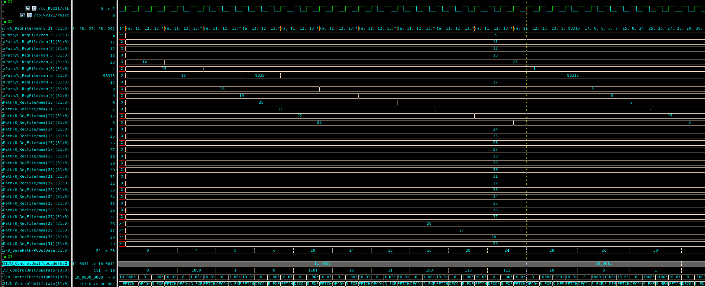
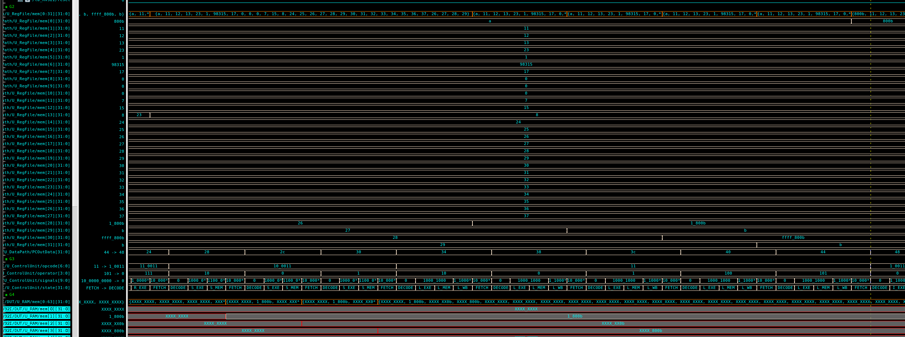
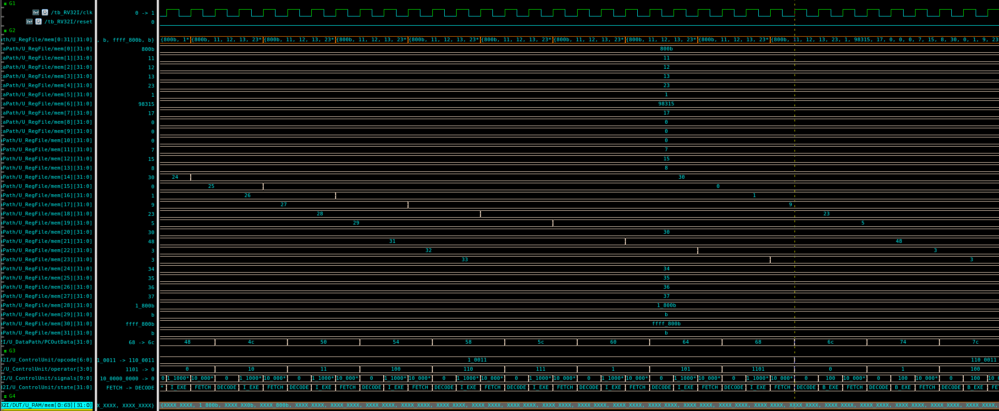
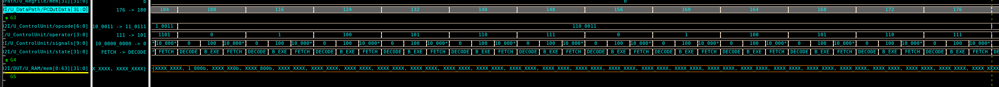
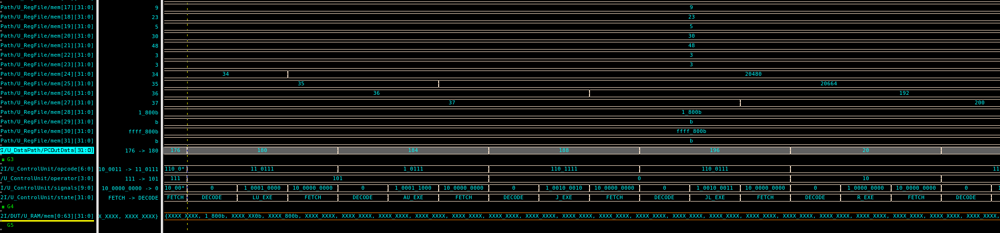

# 🧠 RV32I 32-bit Multi-Cycle CPU Design RAM(SystemVerilog)

본 프로젝트는 오픈소스 명령어 집합 구조인 **RISC-V RV32I**를 기반으로,  
멀티 사이클(Multi-Cycle) 아키텍처로 동작하는 **32비트 CPU**를 SystemVerilog로 구현한 결과물입니다.  

명령어 시퀀스를 **ROM**에 저장하고, **Vivado 2020.2** 환경에서 RTL 시뮬레이션을 통해  
명령어 흐름 및 연산 결과를 검증했습니다.  

---

## 📌 프로젝트 개요
- **설계 구조**: Multi-Cycle 기반 32비트 RV32I CPU  
- **명령어 세트**: RV32I (RISC-V Integer Base ISA)  
- **설계 언어**: SystemVerilog  
- **설계 툴**: Xilinx Vivado 2020.2  
- **테스트**: ROM 기반 테스트벤치를 통한 시뮬레이션  

---

## 🛠️ 개발 환경

| 항목        | 내용                    |
|-------------|-------------------------|
| 설계 언어   | SystemVerilog           |
| 개발 툴     | Xilinx Vivado 2020.2    |
| 시뮬레이션 툴 | Vivado Simulator        |
| 합성 도구   | Vivado Synthesis        |
| 테스트 환경 | ROM 기반 테스트벤치 사용 |

---

## 프로젝트 특징
S 와 L 타입의 Half Byte 기능을 RAM 내부에 구현함

## 📂 디렉토리 구조
```
├── code.mem
├── ControlUnit.sv
├── DataPath.sv
├── defines.sv
├── MCU.sv
├── RAM.sv
├── ROM.sv
└── CPU_RV32I.sv
└── README.md
```

## Vcs Verdi를 통한 검증

### DataPath.sv -> RegisterFile 수정
```verilog
module RegisterFile (
    input  logic        clk,
    input  logic        reset,
    input  logic        we,
    input  logic [ 4:0] RA1,
    input  logic [ 4:0] RA2,
    input  logic [ 4:0] WA,
    input  logic [31:0] WD,
    output logic [31:0] RD1,
    output logic [31:0] RD2
);
    logic [31:0] mem[0:2**5-1];

    integer i;
   // initial begin  // for simulation test
   //     for (i = 0; i < 32; i++) begin
   //         mem[i] = 10 + i;
   //     end
   // end


    always_ff @(posedge clk) begin
   if(reset) begin
      for(int i=0; i<32; i++) begin
         mem[i] = 10 + i;
      end   
       end else if (we) mem[WA] <= WD;
    end

    assign RD1 = (RA1 != 0) ? mem[RA1] : 32'b0;
    assign RD2 = (RA2 != 0) ? mem[RA2] : 32'b0;
endmodule
```

**R-Type**


**S, L-Type**


**I-Type**


**B-Type**


**LU, AU, J, JL-Type**


동일한 결과가 출력되는 것을 확인할 수 있다.