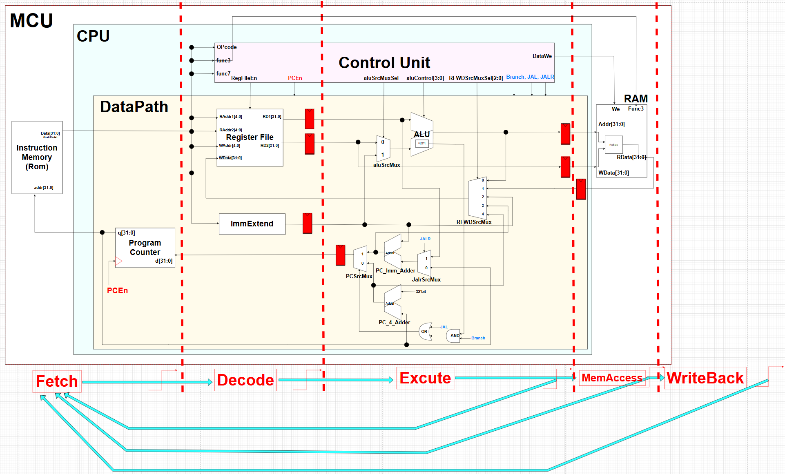

# RISC-V RV32I 32bit CPU Design

## 📝 Overview
본 프로젝트는 **RISC-V RV32I 명령어 집합 구조(ISA)** 를 기반으로,  
**32비트 단일 사이클(Single-Cycle) CPU**와 **다중 사이클(Multi-Cycle) CPU**를 각각 구현한 결과물입니다.  

단일 사이클 구조는 모든 명령어를 한 사이클에 실행하여 설계가 단순하지만,  
멀티 사이클 구조는 명령어를 여러 단계로 나누어 실행하여 자원 활용 효율성을 높이는 특징이 있습니다.  
이를 통해 CPU 설계 방식에 따른 성능 및 구조적 차이를 직접 비교·분석할 수 있습니다.  

CPU 구조, 데이터 경로 설계, 명령어 실행 과정을 직접 구현하고 검증하며 컴퓨터 구조의 핵심 원리를 학습하는 것을 목표로 합니다.

## 🛠️ 개발 환경
| 항목        | 내용                                      |
|-------------|-------------------------------------------|
| 설계 언어   | SystemVerilog                             |
| 개발 툴    | Xilinx Vivado 2020.2                      |
| 시뮬레이션 툴 | Vivado Simulator, VCS, Verdi              |
| 합성 도구   | Vivado Synthesis                          |
| 테스트 환경 | ROM 기반 패턴 주입 테스트벤치              |


## 🔑 주요 특징
- **ISA**: RISC-V RV32I (기본 정수 명령어 집합)
- **아키텍처**  
  - **Single-Cycle**: 모든 명령어가 1 클럭 사이클 내에 완료  
  - **Multi-Cycle**: 명령어를 Fetch, Decode, Execute, Memory, Writeback 단계로 나누어 실행  
- **워드 크기**: 32비트
- **구현 명령어**  
  - 산술/논리 연산 (ADD, SUB, AND, OR, XOR 등)  
  - 메모리 접근 (LW, SW 등)  
  - 제어 흐름 (BEQ, JAL 등)  
- **명령어 메모리**: ROM 기반 프로그램 저장 방식  
- **검증 환경**: **Vivado 2020.2 RTL Simulation**  

## 🛠️ Architecture
- **Control Unit**  
  명령어를 해석하고 각 모듈에 필요한 제어 신호를 생성  

- **Datapath**  
  ALU, 레지스터 파일, 프로그램 카운터(PC) 등을 포함하여  
  실제 연산과 데이터 흐름을 담당하는 핵심 경로  

- **CPU_RV32I**
  Control Unit과 Data Path를 연결하는 Middle 모듈

- **RAM (Data Memory)**  
  LW, SW 등의 메모리 접근 명령어를 수행하는 데이터 메모리  

- **ROM (Instruction Memory)**  
  프로그램 명령어를 저장하고 CPU가 이를 읽어 실행  

- **MCU (Top Module)**  
  Control Unit, Datapath, RAM, ROM을 연결하고  
  CPU 전체 동작을 통합 관리하는 최상위 모듈  


## 🖼️ Block Diagram
**Multi Cycle 구현을 위한 FF 추가 version**


## 🧪 Simulation
Vivado 시뮬레이션을 통해 각 명령에 대한 동작을 검증하였습니다.
모든 타입에 대한 기능이 정상 동작함을 파형으로 확인했습니다.

## 🧹 개선 사항
- **RAM version**: RAM 내부에 기능을 구현, 하드코딩 및 긴 wire delay가 우려됨

- **FSM version**: RAM version을 해결하기 위해 Control Unit에서 FSM에 따라 신호를 처리하고 출력함.
wire delay 감소 및 더 깔끔하게 구현했음

## 📁 File Structure
```
├── 📁 Single Cycle
|    ├── ControlInit.sv
|    ├── DataPath.sv
|    ├── CPU_RV32I.sv
|    ├── RAM.sv
|    ├── ROM.sv
|    ├── Defines.sv
|    ├── MCU.sv
|    └── README.md
├── 📁 Multi Cycle RAM
|    ├── ControlInit.sv
|    ├── DataPath.sv
|    ├── CPU_RV32I.sv
|    ├── RAM.sv
|    ├── ROM.sv
|    ├── Defines.sv
|    ├── MCU.sv
|    ├── code.mem
|    └── README.md
├── 📁 Multi Cycle FSM
|    ├── ControlInit.sv
|    ├── DataPath.sv
|    ├── CPU_RV32I.sv
|    ├── RAM.sv
|    ├── ROM.sv
|    ├── Defines.sv
|    ├── MCU.sv
|    ├── code.mem
|    └── README.md
└── 📁 PPT
```

## 참고
자세한 내용은 PPT를 확인해 주세요

## 추가 사항
**Synopsys VCS & Verdi**를 이용한 검증을 
Multi Cycle RAM README에 기재했습니다.