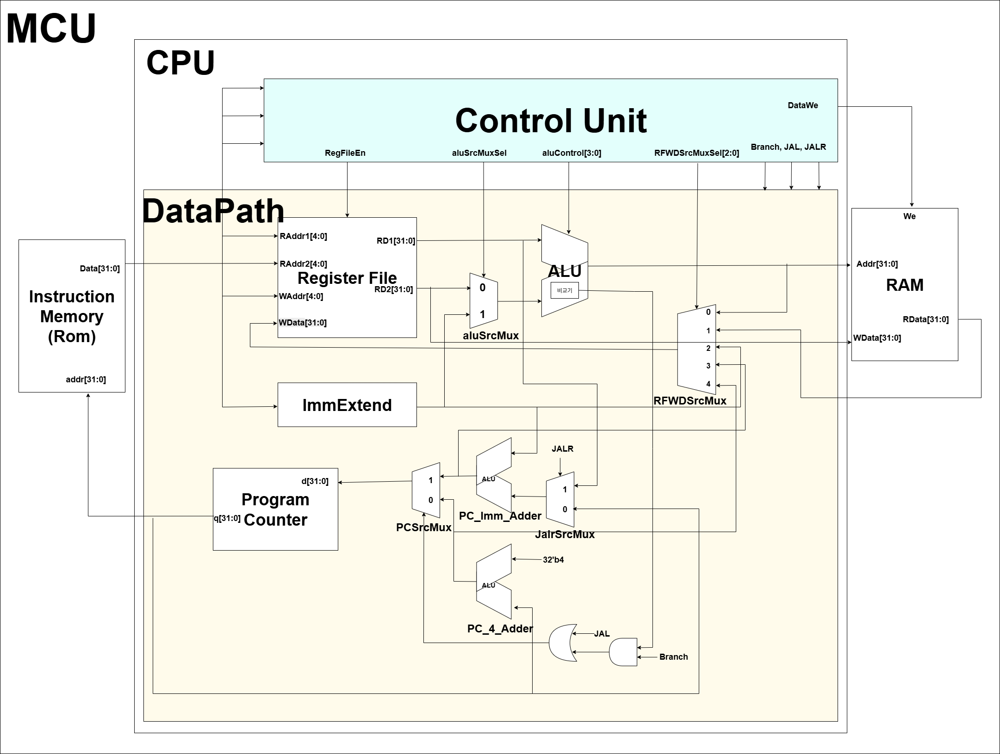

# 🧠 RV32I 32-bit Single-Cycle CPU Design (SystemVerilog)

본 프로젝트는 오픈소스 명령어 집합 구조인 **RISC-V RV32I**를 기반으로,  
단일 사이클(Single-Cycle) 아키텍처로 동작하는 **32비트 CPU**를 SystemVerilog로 구현한 결과물입니다.  

명령어 시퀀스를 **ROM**에 저장하고, **Vivado 2020.2** 환경에서 RTL 시뮬레이션을 통해  
명령어 흐름 및 연산 결과를 검증했습니다.  

---

## 📌 프로젝트 개요
- **설계 구조**: Single-Cycle 기반 32비트 RV32I CPU  
- **명령어 세트**: RV32I (RISC-V Integer Base ISA)  
- **설계 언어**: SystemVerilog  
- **설계 툴**: Xilinx Vivado 2020.2  
- **테스트**: ROM 기반 테스트벤치를 통한 시뮬레이션  

---

## 🛠️ 개발 환경

| 항목        | 내용                    |
|-------------|-------------------------|
| 설계 언어   | SystemVerilog           |
| 개발 툴     | Xilinx Vivado 2020.2    |
| 시뮬레이션 툴 | Vivado Simulator        |
| 합성 도구   | Vivado Synthesis        |
| 테스트 환경 | ROM 기반 테스트벤치 사용 |

---

## 🖼️ Block Diagram


## 📂 디렉토리 구조
```
├── ControlUnit.sv
├── DataPath.sv
├── defines.sv
├── MCU.sv
├── RAM.sv
├── ROM.sv
└── CPU_RV32I.sv
└── README.md
```
```